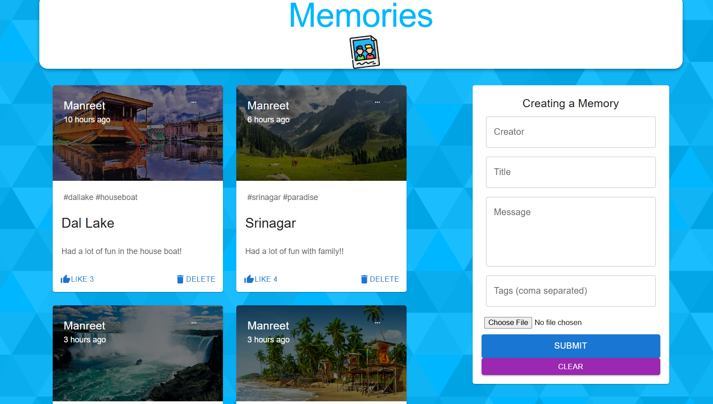

A full-stack MERN (MongoDB, Express, React, Node.js) application that allows users to create, view, edit, like, and delete photo memories. This project is deployed on Render for both frontend and backend.

LINK T0 APP : https://memories-project-frontend-0fv2.onrender.com/

This is a how the Memories App looks like: 
## 🚀 Features

- Post and display photo memories
- Like and delete posts
- Edit existing posts
- Responsive and modern UI using Material-UI
- Stores image data as Base64
- Backend API built with Express and MongoDB
- Deployed frontend  backend with Render

## 🔧 Tech Stack

- **Frontend**: React, Redux, Material-UI, Axios
- **Backend**: Node.js, Express
- **Database**: MongoDB Atlas
- **Deployment**: Render

About the App=>
The Memories App is a full-stack web application that allows users to create and share photo-based posts ("memories"). It mimics a basic version of a social media feed, focusing on core functionality such as:
-Creating a post (with image, title, message, and tags)
-Viewing all posts in a feed
-Liking posts
-Editing and deleting your own posts
